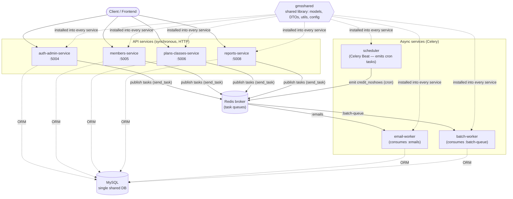
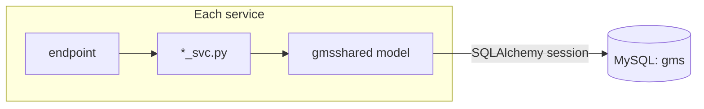
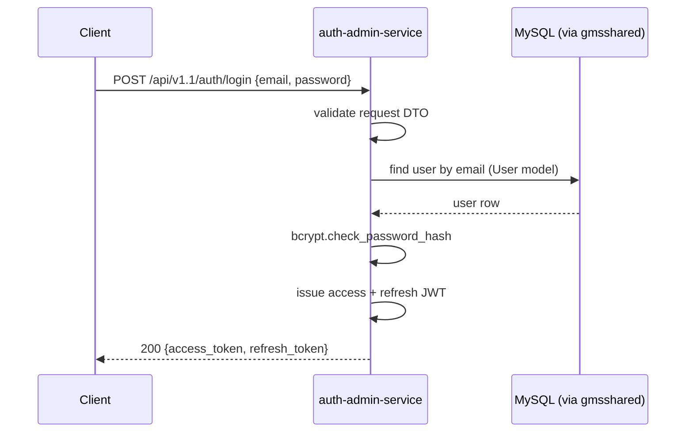
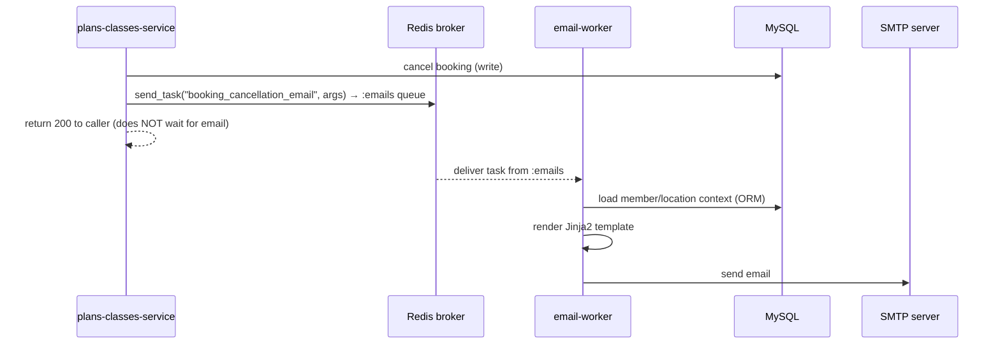
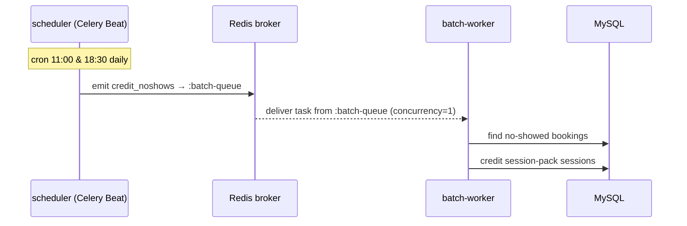
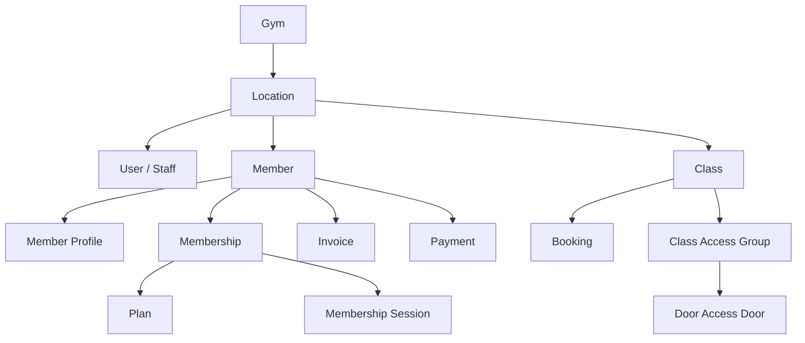

# GMS — Gym Management System (Microservices in Python)

A runnable, teaching-oriented **microservices** backend for a gym-management product, built with
**Flask / FastAPI + SQLAlchemy + Celery + MySQL + Redis**. It is intentionally small enough to read
end-to-end, yet real enough to demonstrate how production microservices are structured, bounded, and
made to cooperate.

> This README is the **single source of truth** for the architecture: every service, what it owns, its
> endpoints, why the boundaries fall where they do, and how everything talks to the database through the
> shared library. It is written to be mined for learning content (code rundowns, diagrams, theory).

---

## Table of contents

1. [Quick start](#quick-start)
2. [System architecture](#system-architecture)
3. [The services at a glance](#the-services-at-a-glance)
4. [Service deep-dives](#service-deep-dives)
   - [auth-admin-service](#1-auth-admin-service-5004)
   - [members-service](#2-members-service-5005)
   - [plans-classes-service](#3-plans-classes-service-5006)
   - [reports-service](#4-reports-service-5008)
   - [email-worker](#5-email-worker)
   - [batch-worker](#6-batch-worker)
   - [scheduler](#7-scheduler)
5. [The shared library: `gmsshared`](#the-shared-library-gmsshared)
6. [How services talk to the database](#how-services-talk-to-the-database)
7. [Service boundaries — the rules](#service-boundaries--the-rules)
8. [Data-flow diagrams](#data-flow-diagrams)
9. [Async work: queues, workers, scheduler](#async-work-queues-workers-scheduler)
10. [Database, migrations & seeding](#database-migrations--seeding)
11. [Tech stack & key patterns](#tech-stack--key-patterns)
12. [Known residue (intentional)](#known-residue-intentional)

---

## Quick start

```bash
cp .env.example .env
./build.sh                     # builds the shared gms-base image, then all services
docker compose up -d           # MySQL + Redis + 4 API services + 3 async services
```

On first start, MySQL auto-loads **`gmsshared/db/init.sql`** — the full schema plus a sample seed
(gym *"Hill Country Mecca"*, location 43, owner/staff + 40 members, 28 plans, 60 memberships, all
reference data).

**Login:** `owner@demo.gym` / `Test@1234` (every seeded user shares that password).

Health checks once up:

| Service | URL |
|---|---|
| auth-admin | `http://localhost:5004/api/v1.1/auth/health` |
| members | `http://localhost:5005/docs` (Swagger UI) |
| plans-classes | `http://localhost:5006/api/v1/pp/health` |
| reports | `http://localhost:5008/api/v1/reports/health` |

Every API service serves interactive OpenAPI docs at **`/docs`** (and the raw spec at `/openapi.json`).

> **Memory note:** the full fleet (9 containers) needs ~10–12 GB allocated to Docker Desktop. With less,
> MySQL can be OOM-killed (exit 137). To run light, start only `db broker auth-admin-service members-service
> plans-classes-service reports-service`.

---

## System architecture

GMS is a set of independent services that share **one MySQL database** (the pragmatic "shared-DB"
choice) and coordinate slow work **asynchronously** through a **Redis** broker. No service calls another
service over HTTP — they cooperate by publishing Celery tasks onto queues.



**Three rules the diagram encodes:**
1. **Services don't call services.** They publish messages to Redis; workers consume them. This keeps
   services decoupled and independently deployable.
2. **One shared database**, accessed only through `gmsshared` SQLAlchemy models — never raw cross-service
   table reaching that bypasses the models.
3. **`gmsshared` is the common spine** — every service installs it, so models/DTOs/utilities stay DRY.

---

## The services at a glance

| Service | Port | Framework | Owns (domain) | Talks to |
|---|---|---|---|---|
| **auth-admin-service** | 5004 | Flask + flask-openapi3 | Identity (auth, JWT, RBAC) **and** org admin (gyms, locations, rooms, staff) | DB, broker |
| **members-service** | 5005 | FastAPI | Members, memberships, invoices, **payments** (Payrix) | DB, broker |
| **plans-classes-service** | 5006 | FastAPI | Plans (pricing) + classes + bookings + class-access-groups | DB, broker |
| **reports-service** | 5008 | FastAPI | Read-only sales / operations / financial reports | DB |
| **email-worker** | — | Celery worker | Rendering + sending all transactional email | DB, broker |
| **batch-worker** | — | Celery worker | The `credit_noshows` batch job | DB, broker |
| **scheduler** | — | Celery Beat | Emitting scheduled (cron) tasks | broker |

> **Naming honesty:** payments live in **members-service**, not in plans-classes-service. The plans
> service only configures *how* a plan is billed; it never moves money.

---

## Service deep-dives

Each service follows the same layered shape:

```
endpoint (route + DTO validation)  →  service layer (*_svc.py, business logic)  →  model (gmsshared ORM)
```

### 1. auth-admin-service (:5004)

**Responsibility:** who you are (authentication) and the organisation you operate (admin). Mounted under
`/api/v1.1`.

**Authentication — public (`/auth`)**

| Method · Path | Job |
|---|---|
| `POST /auth/register` | Register a new owner/gym account |
| `POST /auth/login` | Email + password → access & refresh JWTs |
| `GET /auth/verify` | Verify email via token |
| `GET /auth/setup-profile` | Validate a profile-setup token |
| `POST /auth/verify_and_set_password` | Confirm email + set initial password |
| `POST /auth/send_verification_token` | (Re)send a verification email |
| `GET /auth/forgot_password` | Trigger forgot-password email |
| `POST /auth/forgot_password_reset` | Reset password from token |
| `POST /auth/refresh` | Exchange refresh token for a new access token |
| `GET /auth/door_access/vendors/{vendor_id}/auth_fields` | Door-vendor auth-field schema |

**Authentication — private (`/auth`, authed)**

| Method · Path | Job |
|---|---|
| `GET /auth/user` | Current user (all roles incl. kiosk) |
| `PUT /auth/user` | Update current user |
| `GET /auth/health` | Health check |

**Admin — gyms (`/admin`)**

| Method · Path | Job |
|---|---|
| `PUT /admin/gyms/{gym_id}` | Update gym |
| `GET·PUT /admin/gyms/{gym_id}/main/settings` | Gym main settings |
| `GET·PUT /admin/gyms/{gym_id}/class/settings` | Gym class settings |

**Admin — locations & rooms (`/admin`)**

| Method · Path | Job |
|---|---|
| `GET·POST /admin/locations` | List / create locations |
| `GET·PUT·DELETE /admin/locations/{id}` | Get / update / delete location |
| `GET /admin/locations/{id}/presigned_url` | S3 upload URL for a location asset |
| `PUT /admin/locations/{id}/payrix_onboard` | Set Payrix merchant onboarding info |
| `GET·POST·PUT·DELETE /admin/locations/{id}/rooms…` | Room CRUD |
| `GET /admin/locations/{id}/reports`, `…/{report_id}/url` | QuickSight embedded reports |
| `GET /admin/locations/{id}/contact_us` | Location contact info |
| `POST·GET·PUT /admin/locations/{id}/door_access/doors…` | Door CRUD |
| `PUT /admin/locations/{id}/door_access/member_sync` | Sync members to door vendor |
| `PUT /admin/locations/{id}/door_access/settings` | Door-access settings |
| `GET /admin/locations/{id}/door_access/auth_status` | Door-vendor auth status |

**Admin — staff users (`/admin`)**

| Method · Path | Job |
|---|---|
| `GET·POST /admin/locations/{id}/users` | List / create staff users |
| `GET /admin/locations/{id}/users/{uid}` | Get user |
| `GET·PUT·DELETE /admin/locations/{id}/users/{uid}/profile` | Staff profile CRUD |
| `GET /admin/locations/{id}/users/{uid}/presigned_url` | S3 upload URL for a user asset |

**Service layer:** `auth_public_svc.py` (registration/login/reset/refresh), `auth_private_svc.py`
(self profile), `admin_gym_svc.py`, `admin_location_svc.py`, `admin_user_svc.py`.

---

### 2. members-service (:5005)

**Responsibility:** the member lifecycle and everything financial about a member. Mounted under `/api/v2`.
This is where **payments actually happen** (Payrix).

**Members & memberships (`/members`)**

| Method · Path | Job |
|---|---|
| `GET·POST /members/locations/{id}/members` | List / create members |
| `GET /…/members/{mid}` | Member summary |
| `GET·PUT /…/members/{mid}/profile` | Member profile |
| `GET /…/members/{mid}/reconciliation` | Member balance / reconciliation |
| `GET /…/members/{mid}/activity-history` | Activity history |
| `POST·GET /…/members/{mid}/memberships` | Add / list memberships |
| `GET·PUT /…/memberships/{msid}` | Get / update (incl. cancel) a membership |
| `GET /…/memberships/{msid}/sessions` · `POST·DELETE` | List / add / remove sessions |
| `GET /…/memberships/{msid}/session-history` | Session history |
| `PUT /…/memberships/{msid}/freezes/{fid}` | Update a membership freeze |
| `GET·POST /…/members/{mid}/invoices` | List / create invoices |
| `GET·PUT /…/invoices/{iid}` | Get / update invoice |
| `POST /…/invoices/creditmemo` | Create a credit memo |
| `POST /…/members/{mid}/payrix_onboard` | Onboard member to Payrix |

**Payments (`/members`)**

| Method · Path | Job |
|---|---|
| `POST /members/payrix_txn_updates` | **Webhook** — Payrix transaction-status callback |
| `POST /…/members/{mid}/payrix` | Onboard member to payments |
| `GET /…/members/{mid}/payment-methods` | List payment methods |
| `POST /…/payment-methods/card` · `…/ach` | Add card / ACH method |
| `GET·PUT·DELETE /…/payment-methods/{pmid}` | Manage a payment method |
| `GET·POST /…/members/{mid}/payments` | List / create payments |
| `POST /…/payments/{pid}/refunds` | Refund a payment |
| `POST /…/payments/{pid}/retries` | Retry a failed payment |
| `GET·PUT /…/payments/{pid}` | Get / update (forgive, cancel, restore) |

**Service layer:** `members_private_svc.py` (members, memberships, invoices),
`payments_private_svc.py` (payment methods, charges, refunds, retries),
`payments_public_svc.py` (the webhook reconciliation).

---

### 3. plans-classes-service (:5006)

**Responsibility:** what a member can *buy* (plans) and *attend* (classes & bookings), plus the
door-access groups that gate class access. **No payment processing.** Mounted under `/api/v1`.

**Plans (`/plans`)**

| Method · Path | Job |
|---|---|
| `GET /locations/{id}/plans` | List plans |
| `GET /locations/{id}/plans/{pid}` | Get a plan (with member count) |
| `POST /locations/{id}/plans` | Create plan |
| `PUT /locations/{id}/plans/{pid}` | Update plan |
| `DELETE /locations/{id}/plans/{pid}` | Soft-delete (status → CANCELLED) |

**Classes & bookings (`/classes`)**

| Method · Path | Job |
|---|---|
| `GET /locations/{id}/classes` | List class sessions (date-filtered) |
| `GET·POST·PUT·DELETE /locations/{id}/classes…` | Class CRUD |
| `POST /…/classes/{cid}/status` | Compute class status (preview, no persist) |
| `GET /…/classes/{cid}/bookings`, `/…/classes/bookings` | Bookings for a class / location |
| `POST /locations/{id}/bookings`, `/…/classes/{cid}/bookings` | Book a class or open-gym check-in |
| `GET·PUT·DELETE /…/bookings/{bid}` | Get / check-in / cancel a booking |
| `POST·PUT·GET /locations/{id}/class_access_groups…` | Class-access-group CRUD (door linkage) |

**The booking rules engine** lives in `classes/services/rules.py` + `rules_processor.py` (~2k lines):
eligibility, capacity, session-pack decrement, cancellation windows. It is the richest piece of domain
logic in the repo.

**Service layer:** `plans_private_svc.py`, `classes_private_svc.py`, `rules.py`, `rules_processor.py`.

---

### 4. reports-service (:5008)

**Responsibility:** read-only aggregation. One polymorphic endpoint dispatches by an enum code to the
right report generator. Mounted under `/api/v1/reports`.

| Method · Path | Job |
|---|---|
| `GET /api/v1/reports/locations/{id}/{report}` | Generate a report; `{report}` is a `ReportTypeEnum` code |
| `GET /api/v1/reports/health` | Health check |

Report families (in `services/reports_svc.py`):
- **Sales** — new contacts, new membership sales.
- **Operations** — attendance per month, member-session attendance, at-risk attendance, churn, conversion cohorts, location membership count.
- **Financial** — net revenue, MTD / last-month / forecasted revenue, balance & future contract value.

This service **reads** payment/revenue data (e.g. `MemberPaymentHistory`); it never writes — reinforcing
that money is owned by members-service and surfaced here.

---

### 5. email-worker

A **Celery worker** that consumes the `{ENV}-gms:emails` queue and sends transactional email
(`task → render Jinja2 template → SMTP`). It defines **18 tasks** across:

- `emails/contact.py` — owner/staff verification, password reset, app links, profile-setup (7)
- `emails/session.py` — booking cancellation, waitlist promote, PT session create/update/cancel (10)
- `emails/admin.py` — owner onboarding (1)

Templates live in `email-worker/src/emails/templates/*.j2`.

### 6. batch-worker

A **Celery worker** on the `{ENV}-gms:batch-queue` (concurrency = 1, so the batch job is serialized).
It runs **`credit_noshows`** (`other/tasks/session.py`), which credits session-pack no-shows.

### 7. scheduler

**Celery Beat** — a cron *emitter*, not a worker. It defines no task bodies; it publishes
`credit_noshows` onto the batch queue **twice daily** (11:00 and 18:30). `batch-worker` consumes it.

---

## The shared library: `gmsshared`

Every service is `pip install gmsshared`. It is the common spine and holds:

```
gmsshared/
  src/
    models/        # SQLAlchemy ORM models (user, location, member, membership, plan, class, invoice, payment, _ref_*)
    util/
      decorators.py  # @check_access (RBAC), auth verification, logging
      responses.py   # create_response() — the standard JSON envelope
      exceptions.py  # custom HTTP exceptions
      enums.py       # domain vocabulary (report types, billing types, statuses)
      config.py      # 12-factor config from environment
    web/             # FastAPI/Flask glue (session middleware, exception handlers)
  db/
    init.sql         # full schema + sample seed (loaded by docker-compose on first boot)
    migrations/      # 32 timestamped raw-SQL migrations (the real change history)
  migrations/        # Alembic scaffolding (env.py + one placeholder revision)
  __init__.py        # celery app + send_task() helper
```

**Why a shared library?** Pure DRY — models and helpers are defined once. The trade-off is **coupling**:
a change to a shared model can ripple to every service. That is a deliberate, teachable compromise (the
"shared-DB / shared-lib" pattern) chosen here for simplicity over strict service isolation.

---

## How services talk to the database

- **One MySQL database**, defined and seeded by `gmsshared/db/init.sql`.
- **Every read/write goes through `gmsshared` SQLAlchemy models** — services import e.g.
  `from gmsshared.src.models.member import Member`. No service hand-writes SQL against another domain's
  tables; the models are the contract.
- Models expose shared behavior (e.g. `save_and_commit`, `find_by_*` helpers); heavy reports drop to raw
  SQL *within* a model method, not from the endpoint.
- Workers use the same models outside the request cycle via a `FlaskTask` / session wrapper, so the ORM
  works inside Celery tasks too.



**The boundary rule for data:** a service may only *write* tables it owns. It may *read* shared reference
data and entities it legitimately needs (e.g. plans-classes reads `location.door_access`), but ownership
of a row's lifecycle belongs to exactly one service.

---

## Service boundaries — the rules

GMS splits along **business capability**, one bounded domain per service:

| Domain | Service | Why it is its own boundary |
|---|---|---|
| Identity & org setup | auth-admin | Changes for security/onboarding reasons, different release cadence; everything else depends on it |
| Member lifecycle & money | members | High-value, compliance-sensitive (payments); isolating it limits blast radius |
| Catalog & scheduling | plans-classes | Read-heavy, complex rules engine; evolves with product/booking features |
| Analytics | reports | Read-only; can be scaled/cached independently and must never block writes |

**Do:**
- Keep one domain's *write* authority in one service.
- Let services cooperate **asynchronously** (publish a task) instead of synchronous service-to-service calls.
- Put anything shared (models, helpers) in `gmsshared`, not copied per service.

**Don't:**
- **Don't merge** members + plans-classes "because they share tables" — they change for different reasons
  (billing/compliance vs. scheduling features). Shared *tables* are fine; shared *responsibility* is not.
- **Don't merge** the two workers into one process — `batch-worker` needs serialized concurrency (=1)
  while `email-worker` runs in parallel; one process can't satisfy both. (The **scheduler** must also stay
  separate — Beat must be a single emitter.)
- **Don't** have one service reach into another's domain tables to write — go through that domain's service
  or publish a task.
- **Don't** add synchronous HTTP calls between services — it reintroduces the coupling microservices exist
  to avoid.

---

## Data-flow diagrams

### A. Synchronous request (login)



### B. Asynchronous email (a booking is cancelled)

No service calls the email-worker directly — it publishes a task and returns immediately.



### C. Scheduled batch job (no-show crediting)



### D. Domain model (high level)



---

## Async work: queues, workers, scheduler

| Piece | Type | Queue | Role |
|---|---|---|---|
| `email-worker` | worker (consumer) | `{ENV}-gms:emails` | render + send email |
| `batch-worker` | worker (consumer) | `{ENV}-gms:batch-queue` | run `credit_noshows` (concurrency 1) |
| `scheduler` | beat (emitter) | — (publishes to batch-queue) | cron trigger, defines no tasks |

- **Producer side:** API services call `gmsshared.celery.send_task("task_name", args)`; `task_routes`
  config maps each task name to a queue.
- **Why Redis:** it is the Celery broker (message transport) and result backend; services reach it as
  `broker:6379` on the compose network.
- **ORM in tasks:** workers wrap task execution so a DB session is available — the same models used in
  request handlers work inside Celery.

---

## Database, migrations & seeding

- **Schema + seed:** `gmsshared/db/init.sql` (87 tables + reference data + a sample gym). MySQL runs it
  automatically on first boot (mounted into `/docker-entrypoint-initdb.d`). This is the **single source of
  truth** for the schema.
- **Raw-SQL migrations:** `gmsshared/db/migrations/*.sql` — 32 timestamped, ticket-tagged deltas; the real
  change history (e.g. "add block-registrations-on-balance-due column").
- **Alembic:** `gmsshared/migrations/` holds the Alembic scaffolding and one placeholder revision —
  present to demonstrate the pattern; it does not build the schema itself.
- **Regenerating the seed:** `scripts/seed_from_stage.py` copies a capped slice (gym 43, 40 members, 60
  memberships) from a source DB and hashes every password to `Test@1234`.

---

## Tech stack & key patterns

- **Web:** Flask + flask-openapi3 (auth-admin) and FastAPI (members, plans-classes, reports) — both expose
  OpenAPI docs at `/docs`.
- **App factory:** each service boots via `create_app()` in `*/src/__init__.py`.
- **Layered flow:** `endpoint → DTO (Pydantic) → service (*_svc.py) → model (gmsshared)`.
- **Validation at the boundary:** request/response DTOs reject bad input early (HTTP 422).
- **Standard envelope:** `create_response()` gives every endpoint the same JSON shape; custom exceptions
  produce clean HTTP errors.
- **AuthN/Z:** JWT issued by auth-admin, verified everywhere via `gmsshared` decorators; `@check_access`
  enforces role-based access.
- **Containerization:** every image is `FROM gms-base` (heavy deps compiled once); `gunicorn` runs the WSGI/ASGI
  app; `docker-compose.yml` wires the whole system with health checks and dependency ordering.

---

## Known residue (intentional)

This is the conservative slim — kept runnable. A few payment/door-access vestiges remain:

- members-service still publishes `process_payment_v2` and `door_access_*` tasks to Redis, but **no worker
  in this repo consumes them** (the original consumers live elsewhere). The API still works — these messages
  are simply never processed.
- auth-admin and plans-classes keep live door-access config/columns; `gmsshared` decorators still write a
  `DoorAccessLog`.

A future pass can strip these for a fully payments/door-free tree. Until then, treat Payrix/door-access as
"present but out of scope," not as core teaching material.
